# System Architecture

*Structural Design of the Alaris Trading System*

**Version:** 2.0  
**Status:** Reference

---

## 1. Architectural Principles

The Alaris architecture follows these governing principles:

**Separation of Concerns.** Each component has a single, well-defined responsibility. Pricing logic does not know about data feeds; signal generation does not know about order execution.

**Dependency Inversion.** High-level modules do not depend on low-level modules. Both depend on abstractions. The Strategy layer defines interfaces; the Infrastructure layer implements them.

**Explicit State.** State is visible and auditable. No hidden caches, no implicit global state, no action at a distance.

**Fail-Safe Defaults.** When uncertain, do nothing. Missing data produces no signal. Invalid configuration prevents startup.

**Idempotent Operations.** Operations can be safely retried. Duplicate messages are handled gracefully.

---

## 2. Layer Diagram

The system is organised into four layers with strictly controlled dependencies:


---

## 3. Component Responsibilities

### 3.1 Presentation Layer

**Alaris.Host**

The entry point and user interface:

| Responsibility | Description |
|----------------|-------------|
| Command parsing | Parses CLI arguments and dispatches to commands |
| TUI rendering | Renders terminal user interface via Spectre.Console |
| Configuration loading | Loads and validates configuration files |
| Service orchestration | Wires up dependency injection and starts services |
| LEAN hosting | Hosts the QuantConnect LEAN engine for backtesting |

Dependencies: Alaris.Algorithm, Alaris.Strategy, Alaris.Infrastructure

### 3.2 Application Layer

**Alaris.Strategy**

Trading strategy implementation:

| Responsibility | Description |
|----------------|-------------|
| Signal generation | Evaluates signal criteria and produces recommendations |
| Position construction | Determines leg selection and sizing |
| Risk management | Implements limits, circuit breakers, and exposure controls |
| Trade orchestration | Coordinates entry and exit workflows |

Dependencies: Alaris.Core, Alaris.Infrastructure

**Alaris.Algorithm**

QuantConnect LEAN integration:

| Responsibility | Description |
|----------------|-------------|
| Algorithm implementation | Implements QCAlgorithm-derived trading algorithms |
| Universe selection | Defines stock universe and filtering logic |
| Order management | Submits and manages orders through LEAN |
| Scheduling | Schedules periodic tasks (scans, rebalancing) |

Dependencies: Alaris.Strategy, Alaris.Infrastructure, QuantConnect LEAN

**Alaris.Simulation**

Backtesting and simulation:

| Responsibility | Description |
|----------------|-------------|
| Historical replay | Replays historical data for backtesting |
| Walk-forward optimisation | Implements train/test window analysis |
| Performance attribution | Decomposes returns by factor |
| Report generation | Produces performance reports |

Dependencies: Alaris.Strategy, Alaris.Infrastructure

### 3.3 Domain Layer

**Alaris.Core**

Pure mathematical and domain logic:

| Responsibility | Description |
|----------------|-------------|
| Option pricing | Black-Scholes, American option pricing |
| Greeks calculation | Delta, gamma, theta, vega, rho |
| Volatility estimation | Yang-Zhang and other estimators |
| Position sizing | Kelly criterion and fractional sizing |
| Calendar spread analytics | Spread valuation and risk metrics |

Dependencies: None (pure functions)

### 3.4 Infrastructure Layer

**Alaris.Infrastructure**

External system integration:

| Responsibility | Description |
|----------------|-------------|
| Market data | Polygon.io integration for quotes and chains |
| Earnings data | FMP integration for earnings calendar |
| Persistence | File-based and database persistence |
| Messaging | Event publication and subscription |
| Caching | In-memory caching with expiration |

Dependencies: Alaris.Core (for data types)

**Alaris.Library**

Native bindings:

| Responsibility | Description |
|----------------|-------------|
| QuantLib wrapper | SWIG-generated bindings to QuantLib C++ |
| Native loading | Platform-specific library loading |

Dependencies: None (native libraries)

---

## 4. Directory Structure

```
Alaris/
├── Alaris.sln                    # Solution file
├── Directory.Build.props         # Centralised build configuration
├── README.md                     # Project overview
│
├── docs/                         # Documentation
│   ├── philosophy.md             # Design philosophy
│   ├── foundations.md            # Mathematical theory
│   ├── specification.md          # Formal specification
│   ├── guide.md                  # Practical guide
│   ├── standard.md               # Coding standard
│   ├── architecture.md           # This document
│   └── README.md                 # Documentation index
│
├── src/                          # Source code
│   ├── Alaris.Core/              # Domain layer
│   │   ├── Pricing/              # Option pricing (CREN*.cs)
│   │   ├── Math/                 # Mathematical utilities (CRMF*.cs)
│   │   ├── Options/              # Option models (CROP*.cs)
│   │   └── Time/                 # Date/time utilities (CRTM*.cs)
│   │
│   ├── Alaris.Strategy/          # Application layer - strategy
│   │   ├── Signals/              # Signal generation (STCR*.cs)
│   │   ├── Risk/                 # Risk management (STHD*.cs)
│   │   └── Sizing/               # Position sizing (STRK*.cs)
│   │
│   ├── Alaris.Algorithm/         # Application layer - LEAN
│   │   └── Algorithms/           # Algorithm implementations
│   │
│   ├── Alaris.Simulation/        # Backtesting and simulation
│   │
│   ├── Alaris.Infrastructure/    # Infrastructure layer
│   │   ├── Data/                 # Data acquisition (DT*.cs)
│   │   ├── Events/               # Event sourcing (EV*.cs)
│   │   └── Protocol/             # Binary protocol (PL*.cs)
│   │
│   ├── Alaris.Host/              # Presentation layer (CLI, TUI)
│   │
│   ├── Alaris.Library/           # Native bindings
│   │   ├── Native/               # SWIG wrappers
│   │   └── Runtime/              # Shared libraries
│   │
│   └── Alaris.Test/              # Test project (TS*.cs)
│
├── lib/                          # External dependencies
│   └── Alaris.Lean/              # QuantConnect LEAN (submodule)
│
└── ses/                          # Runtime session data (gitignored)
    ├── index.json                # Session manifest
    └── {TYPE}-{DATE}-{TIME}/     # Individual sessions
    ├── Algorithm/
    ├── Algorithm.Framework/
    ├── Common/
    ├── Compression/
    ├── Configuration/
    ├── Indicators/
    ├── Launcher/
    └── Logging/
```

---

## 5. Naming Conventions

### 5.1 Component Code System

Alaris uses a structured component code system for traceability and audit purposes. This aerospace-derived pattern enables precise identification and reference in documentation and logs.

**Format:** `[Domain][Category][Sequence][Variant]`

**Example:** `CREN004A`
- **Domain:** `CR` (Core)
- **Category:** `EN` (Engine)
- **Sequence:** `004`
- **Variant:** `A` (Primary)

### 5.2 Domain Codes

| Code | Domain | Description |
|------|--------|-------------|
| `CR` | Core | Mathematical primitives, pricing, Greeks |
| `ST` | Strategy | Signal generation, risk management |
| `DT` | Data | Data acquisition, feeds |
| `EV` | Events | Event sourcing, messaging |
| `PL` | Protocol | Binary serialisation, SBE |
| `AP` | Application | CLI, TUI, hosting |
| `TS` | Test | Unit, integration, benchmark |

### 5.3 Category Codes

| Code | Category | Example |
|------|----------|---------|
| `EN` | Engine | Pricing engines |
| `MF` | Math Function | Mathematical utilities |
| `CH` | Chebyshev | Spectral methods |
| `GQ` | Gauss Quadrature | Numerical integration |
| `OP` | Option | Option models |
| `TS` | Term Structure | Yield curves |
| `TM` | Time | Date and time utilities |
| `VL` | Validation | Input validation |
| `PL` | Pool | Memory pooling |

### 5.4 Variant Codes

| Code | Meaning | Usage |
|------|---------|-------|
| `A` | Primary | Default implementation |
| `B` | Alternative | Secondary approach |
| `X` | Experimental | Under development |

### 5.5 Directory Naming

- **Projects:** `Alaris.{Layer}` (e.g., `Alaris.Core`, `Alaris.Strategy`)
- **Subdirectories:** PascalCase by feature (e.g., `Pricing/`, `Options/`, `Signals/`)
- **Files:** Component code with `.cs` extension (e.g., `CREN004A.cs`)

---

## 6. Data Flow

### 6.1 Signal Generation Flow

```mermaid
flowchart LR
    A["📊 Market Data"] --> B["Alaris.Infrastructure<br/>(Polygon API)"]
    B --> C["Alaris.Strategy<br/>(Signal Engine)"]
    C --> D["Alaris.Core<br/>(Yang-Zhang IV)"]
    D --> E["✅ Signal<br/>Recommended"]

    style A fill:#bbdefb
    style B fill:#fce4ec
    style C fill:#fff3e0
    style D fill:#e8f5e9
    style E fill:#c8e6c9
```



1. Infrastructure fetches market data from Polygon.io
2. Strategy receives normalised market data
3. Strategy calls Core for volatility estimation
4. Strategy evaluates signal criteria
5. Signal is produced with recommendation

### 6.2 Trade Execution Flow

```mermaid
flowchart LR
    A["📋 Signal"] --> B["Alaris.Algorithm<br/>(Order Builder)"]
    B --> C["LEAN Engine<br/>(Execution)"]
    C --> D["Broker API<br/>(Order Routing)"]
    D --> E["📝 Fill Report"]

    style A fill:#fff3e0
    style B fill:#fff3e0
    style C fill:#e3f2fd
    style D fill:#fce4ec
    style E fill:#c8e6c9
```



1. Signal triggers order construction
2. Algorithm builds calendar spread order
3. LEAN submits order to broker
4. Broker executes order
5. Fill report is recorded

---

## 7. Cross-Cutting Concerns

### 6.1 Logging

Structured logging via `Microsoft.Extensions.Logging`:

```csharp
_logger.LogInformation("Signal generated for {Symbol}: {Strength}", symbol, strength);
```

All components inject `ILogger<T>` through constructor.

### 6.2 Configuration

Configuration via `Microsoft.Extensions.Configuration`:

- `appsettings.json` for base configuration
- `appsettings.{Environment}.json` for environment overrides
- Environment variables for secrets

### 6.3 Error Handling

Error handling follows the coding standard:

- No silent failures
- Specific exception types
- Circuit breakers for external dependencies
- Graceful degradation under failure

### 6.4 Testing

Testing follows a pyramid structure:

| Level | Coverage Target | Location |
|-------|-----------------|----------|
| Unit tests | Core: 100%, Strategy: 90% | `Alaris.Test/Core/`, `Alaris.Test/Strategy/` |
| Integration tests | Critical paths | `Alaris.Test/Integration/` |
| End-to-end tests | Happy paths | Manual/scheduled |

---

## 8. Session Management

### 8.1 Session Types

| Code | Type | Description |
|------|------|-------------|
| `BT` | Backtest | Historical simulation |
| `LT` | Live Trading | Production execution |
| `PT` | Paper Trading | Simulated live execution |
| `WF` | Walk-Forward | Walk-forward optimisation |
| `SIM` | Simulation | Monte Carlo analysis |

### 8.2 Session Naming

Format: `{TYPE}-{YYYYMMDD}-{HHMMSS}`

Examples:
- `BT-20250105-143022` — Backtest started 2025-01-05 at 14:30:22
- `LT-20250106-093000` — Live trading session started 2025-01-06 at 09:30:00

### 8.3 Session Directory Structure

```
ses/
├── index.json                    # Session manifest
└── BT-20250105-143022/           # Individual session
    ├── session.json              # Session metadata
    ├── data/                     # Cached input data
    │   ├── market/               # Market data snapshots
    │   ├── earnings/             # Earnings calendar
    │   └── universe/             # Universe constituents
    ├── results/                  # Output results
    │   ├── trades.json           # Trade records
    │   ├── performance.json      # Performance metrics
    │   ├── signals.json          # Generated signals
    │   └── charts/               # Visualisations
    └── logs/                     # Session-specific logs
```

### 8.4 Session Metadata Schema

```json
{
  "sessionId": "BT-20250105-143022",
  "type": "BT",
  "status": "Completed",
  "createdAt": "2025-01-05T14:30:22Z",
  "completedAt": "2025-01-05T15:45:33Z",
  "parameters": {
    "startDate": "2023-01-01",
    "endDate": "2024-12-31",
    "initialCash": 100000,
    "universe": ["AAPL", "NVDA", "MSFT"]
  },
  "results": {
    "totalReturn": 0.472,
    "sharpeRatio": 1.24,
    "maxDrawdown": -0.124,
    "tradeCount": 847
  }
}
```

---

## 9. Secrets Management

### 8.1 Development Secrets

For local development, use .NET User Secrets:

```bash
# Initialise user secrets for a project
dotnet user-secrets init --project src/Alaris.Host

# Set a secret
dotnet user-secrets set "Polygon:ApiKey" "your-api-key" --project src/Alaris.Host

# List secrets
dotnet user-secrets list --project src/Alaris.Host
```

User secrets are stored outside the repository in:
- **Linux/macOS:** `~/.microsoft/usersecrets/<user_secrets_id>/secrets.json`
- **Windows:** `%APPDATA%\Microsoft\UserSecrets\<user_secrets_id>\secrets.json`

### 8.2 Production Secrets

For production deployments, use environment variables:

```bash
export POLYGON__APIKEY="your-api-key"
export FMP__APIKEY="your-api-key"
export INTERACTIVEBROKERS__ACCOUNT="your-account"
```

Configuration providers are loaded in order; environment variables override file-based settings.

### 8.3 Configuration Hierarchy

1. `appsettings.json` (base configuration, committed)
2. `appsettings.{Environment}.json` (environment overrides, committed)
3. User Secrets (development only, not committed)
4. Environment Variables (production, not committed)
5. Command-line arguments (highest priority)

### 8.4 Prohibited Practices

- NEVER commit API keys to source control
- NEVER log secrets or include them in error messages
- NEVER hardcode secrets in source code
- The `appsettings.local.jsonc` pattern is deprecated; use User Secrets instead

---

## 10. Deployment

### 7.1 Build Configuration

The solution uses centralised build configuration via `Directory.Build.props`:

- Target framework: .NET 10.0
- Language version: Latest
- Nullable reference types: Enabled
- Treat warnings as errors: Enabled

### 7.2 Output Structure

```
bin/
├── Debug/net10.0/
│   ├── Alaris.Host.dll           # Entry point
│   ├── Alaris.Algorithm.dll      # Algorithm
│   ├── Alaris.Strategy.dll       # Strategy
│   ├── Alaris.Core.dll           # Core
│   ├── Alaris.Infrastructure.dll # Infrastructure
│   ├── libNQuantLibc.so          # QuantLib wrapper
│   ├── libQuantLib.so            # QuantLib library
│   └── appsettings.json          # Configuration
└── Release/net10.0/
    └── (same structure)
```

### 7.3 Startup Sequence

1. Load configuration from files and environment
2. Validate configuration
3. Initialise logging
4. Register services in DI container
5. Verify external dependencies (data feeds, broker)
6. Start background services
7. Ready for commands

---

## 11. Interface Contracts

### 8.1 Signal Generation

```csharp
public interface ISignalGenerator
{
    Task<Signal> GenerateAsync(string symbol, CancellationToken ct = default);
    Task<IReadOnlyList<Signal>> ScanAsync(IEnumerable<string> symbols, CancellationToken ct = default);
}
```

### 8.2 Market Data

```csharp
public interface IMarketDataProvider
{
    Task<Quote> GetQuoteAsync(string symbol, CancellationToken ct = default);
    Task<OptionChain> GetOptionChainAsync(string symbol, CancellationToken ct = default);
    Task<IReadOnlyList<OhlcBar>> GetHistoryAsync(string symbol, DateOnly start, DateOnly end, CancellationToken ct = default);
}
```

### 8.3 Pricing

```csharp
public interface IOptionPricer
{
    decimal Price(PricingInputs inputs);
    Greeks CalculateGreeks(PricingInputs inputs);
    decimal ImpliedVolatility(decimal marketPrice, PricingInputs inputs);
}
```

### 8.4 Volatility

```csharp
public interface IVolatilityEstimator
{
    decimal Estimate(IReadOnlyList<OhlcBar> bars);
}
```

---

*End of Architecture*
