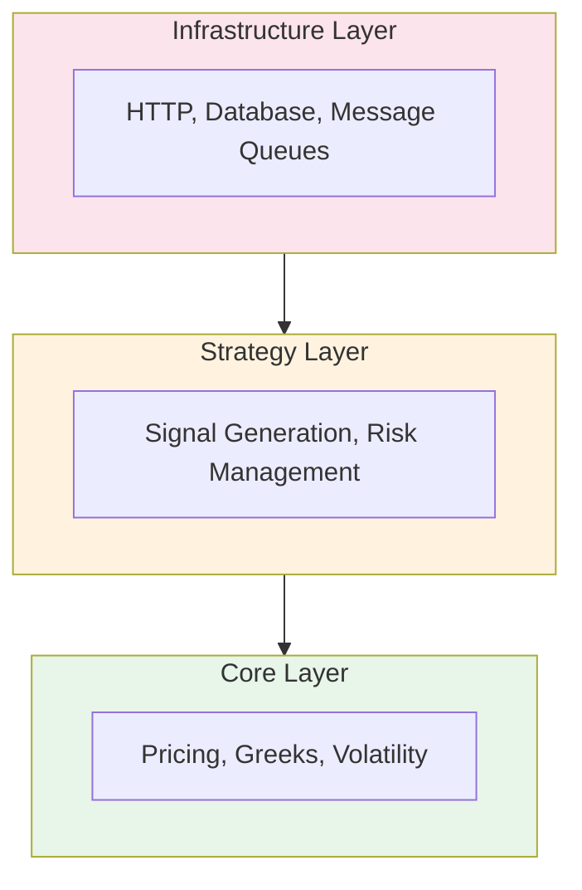

# Alaris Coding Standard

*Governance for High-Integrity Trading Systems*

> "There are two ways of constructing a software design: one way is to make it so simple that there are obviously no deficiencies, and the other way is to make it so complicated that there are no obvious deficiencies."
> — C.A.R. Hoare

## Preface

Programming trading systems differs from ordinary software development. A bug in conventional code causes incorrect output. A bug in Alaris can cause financial loss, regulatory violation, or silent portfolio degradation over time.

This standard exists to prevent trading catastrophes. It codifies practices for building systems where correctness is paramount and failures must be detected, contained, and recovered from gracefully. See [Types](types.md) for type design, units, and invariants.

The rules are organised by severity:

| Level | Meaning | Violation Consequence |
|-------|---------|----------------------|
| **MUST** | Mandatory | System is incorrect or unsafe |
| **SHOULD** | Strongly recommended | System may misbehave under stress |
| **MAY** | Optional best practice | Reduced maintainability |

---

## Part I: Financial Integrity

These rules ensure correctness in financial calculations.

### Rule 1: Decimal Precision

**Level:** MUST

All monetary values and prices MUST use `decimal` type; never `float` or `double`.

**Rationale:** Binary floating-point cannot exactly represent most decimal fractions. A price of $19.99 becomes 19.989999999999998... in `double`, causing cumulative errors.

**Violation Example:**
```csharp
// VIOLATION: Using double for money
double price = 19.99;
double total = price * 100;  // May not equal 1999.00 exactly
```

**Compliant Example:**
```csharp
// COMPLIANT: Using decimal for money
decimal price = 19.99m;
decimal total = price * 100;  // Exactly 1999.00
```

### Rule 2: Explicit Rounding

**Level:** MUST

All financial calculations that require rounding MUST specify the rounding mode explicitly.

**Rationale:** Default rounding behaviour varies by platform and can cause systematic bias in aggregate calculations.

**Violation Example:**
```csharp
// VIOLATION: Implicit rounding
decimal rounded = Math.Round(value);
```

**Compliant Example:**
```csharp
// COMPLIANT: Explicit rounding mode
decimal rounded = Math.Round(value, 2, MidpointRounding.ToEven);  // Banker's rounding
decimal truncated = Math.Round(value, 2, MidpointRounding.ToZero);  // Truncation
```

### Rule 3: Price Validation

**Level:** MUST

All prices received from external sources MUST be validated before use.

**Rationale:** Data feeds occasionally deliver erroneous prices (stale, malformed, or clearly impossible values). Using invalid prices corrupts calculations downstream.

**Violation Example:**
```csharp
// VIOLATION: Trusting external data
var price = dataFeed.GetPrice(symbol);
var greeks = CalculateGreeks(price);  // May use garbage data
```

**Compliant Example:**
```csharp
// COMPLIANT: Validate before use
var price = dataFeed.GetPrice(symbol);

if (!PriceValidator.IsReasonable(price, symbol, lastKnownPrice))
{
    throw new InvalidPriceException(symbol, price, "Price failed reasonableness check");
}

var greeks = CalculateGreeks(price);
```

### Rule 4: Audit Trail

**Level:** SHOULD

Price calculations SHOULD preserve their input provenance.

**Rationale:** When a calculated value appears incorrect, you need to trace back to the inputs that produced it.

**Weak Example:**
```csharp
// WEAK: No provenance
public decimal CalculateTheoPrice(Option option)
{
    return _pricer.Price(option.Strike, option.Expiry, ...);
}
```

**Stronger Example:**
```csharp
// STRONGER: Preserves provenance
public PricingResult CalculateTheoPrice(Option option, MarketSnapshot snapshot)
{
    var inputs = new PricingInputs
    {
        Strike = option.Strike,
        Expiry = option.Expiry,
        SpotPrice = snapshot.UnderlyingPrice,
        ImpliedVol = snapshot.ImpliedVol,
        RiskFreeRate = snapshot.RiskFreeRate,
        Timestamp = snapshot.Timestamp
    };

    var theoPrice = _pricer.Price(inputs);

    return new PricingResult
    {
        TheoPrice = theoPrice,
        Inputs = inputs,
        Model = "SpectralCollocation",
        ComputedAt = DateTime.UtcNow
    };
}
```

---

## Part II: Error Handling

These rules ensure failures are detected and contained.

### Rule 5: No Silent Failures

**Level:** MUST

Operations that can fail MUST either throw an exception or return a Result type. Silent failure is forbidden.

**Rationale:** Silent failures propagate incorrect state through the system, causing bugs that are difficult to diagnose.

**Violation Example:**
```csharp
// VIOLATION: Silent failure
public decimal? GetVolatility(string symbol)
{
    try
    {
        return _volatilityService.Calculate(symbol);
    }
    catch
    {
        return null;  // Caller may not check for null
    }
}
```

**Compliant Example:**
```csharp
// COMPLIANT: Explicit failure
public Result<decimal, VolatilityError> GetVolatility(string symbol)
{
    try
    {
        var vol = _volatilityService.Calculate(symbol);
        return Result.Success(vol);
    }
    catch (InsufficientDataException ex)
    {
        return Result.Failure(VolatilityError.InsufficientData(ex.Message));
    }
}
```

### Rule 6: Exception Specificity

**Level:** MUST

Catch blocks MUST NOT catch `System.Exception` without rethrowing, unless at an application boundary.

**Rationale:** Catching all exceptions hides programming errors (null reference, index out of bounds) that indicate bugs.

**Violation Example:**
```csharp
// VIOLATION: Catching everything
try
{
    ProcessOrder(order);
}
catch (Exception)
{
    _logger.LogError("Order failed");
    // Bug may be hidden here
}
```

**Compliant Example:**
```csharp
// COMPLIANT: Specific catches
try
{
    ProcessOrder(order);
}
catch (OrderValidationException ex)
{
    _logger.LogWarning("Invalid order: {Message}", ex.Message);
    return OrderResult.Invalid(ex.Violations);
}
catch (InsufficientLiquidityException ex)
{
    _logger.LogWarning("Insufficient liquidity: {Message}", ex.Message);
    return OrderResult.Rejected("Insufficient liquidity");
}
// Programming errors (NullReferenceException, etc.) propagate up
```

### Rule 7: Fail Fast

**Level:** SHOULD

Invalid state SHOULD be detected and rejected as early as possible.

**Rationale:** Catching errors early prevents corruption from spreading and simplifies debugging.

**Late Detection:**
```csharp
// LATE: Error discovered deep in calculation
public decimal CalculateSpread(CalendarSpread spread)
{
    var frontPrice = _pricer.Price(spread.FrontLeg);
    var backPrice = _pricer.Price(spread.BackLeg);

    // Error discovered here, yet inputs were accepted long ago
    if (spread.FrontLeg.Expiry >= spread.BackLeg.Expiry)
        throw new InvalidSpreadException("Front leg must expire before back leg");

    return backPrice - frontPrice;
}
```

**Early Detection:**
```csharp
// EARLY: Error caught at construction
public class CalendarSpread
{
    public CalendarSpread(OptionLeg frontLeg, OptionLeg backLeg)
    {
        if (frontLeg.Expiry >= backLeg.Expiry)
            throw new ArgumentException("Front leg must expire before back leg");

        FrontLeg = frontLeg;
        BackLeg = backLeg;
    }
}
```

### Rule 8: Circuit Breaker Pattern

**Level:** SHOULD

Operations that interact with external systems SHOULD implement circuit breaker patterns.

**Rationale:** When an external dependency fails, continued attempts waste resources and can cascade failures.

```csharp
public class DataFeedClient
{
    private readonly CircuitBreaker _breaker = new CircuitBreaker(
        failureThreshold: 5,
        recoveryTimeout: TimeSpan.FromMinutes(1)
    );

    public async Task<Quote> GetQuoteAsync(string symbol)
    {
        return await _breaker.ExecuteAsync(async () =>
        {
            return await _httpClient.GetAsync<Quote>($"/quote/{symbol}");
        });
    }
}
```

---

## Part III: Immutability and State

These rules minimise mutable state.

### Rule 9: Immutable Domain Objects

**Level:** SHOULD

Domain objects representing market data, prices, and calculations SHOULD be immutable.

**Rationale:** Immutable objects cannot be corrupted after construction, eliminating a class of concurrency bugs.

**Mutable:**
```csharp
// MUTABLE: Can be modified after creation
public class Quote
{
    public decimal Bid { get; set; }
    public decimal Ask { get; set; }
    public DateTime Timestamp { get; set; }
}
```

**Immutable:**
```csharp
// IMMUTABLE: Cannot change after construction
public sealed record Quote(
    decimal Bid,
    decimal Ask,
    DateTime Timestamp
);
```

### Rule 10: Explicit State Transitions

**Level:** SHOULD

Objects with lifecycle states SHOULD enforce valid transitions explicitly.

**Rationale:** Invalid state transitions indicate logic errors. Making them impossible prevents bugs.

**Implicit:**
```csharp
// IMPLICIT: Any transition allowed
public class Order
{
    public OrderStatus Status { get; set; }
}

order.Status = OrderStatus.Filled;  // Was it even submitted?
```

**Explicit:**
```csharp
// EXPLICIT: Only valid transitions allowed
public class Order
{
    public OrderStatus Status { get; private set; } = OrderStatus.Created;

    public void Submit()
    {
        if (Status != OrderStatus.Created)
            throw new InvalidOperationException($"Cannot submit order in {Status} state");
        Status = OrderStatus.Submitted;
    }

    public void Fill(decimal price, int quantity)
    {
        if (Status != OrderStatus.Submitted)
            throw new InvalidOperationException($"Cannot fill order in {Status} state");
        // Record fill details
        Status = OrderStatus.Filled;
    }
}
```

### Rule 11: No Shared Mutable State

**Level:** MUST

Mutable state MUST NOT be shared between concurrent operations without synchronisation.

**Rationale:** Unsynchronised shared state causes race conditions that manifest as intermittent, difficult-to-reproduce bugs.

**Violation Example:**
```csharp
// VIOLATION: Shared mutable state
private Dictionary<string, decimal> _cache = new();

public decimal GetCachedPrice(string symbol)
{
    if (_cache.TryGetValue(symbol, out var price))
        return price;

    price = FetchPrice(symbol);
    _cache[symbol] = price;  // Race condition!
    return price;
}
```

**Compliant Example:**
```csharp
// COMPLIANT: Thread-safe cache
private readonly ConcurrentDictionary<string, decimal> _cache = new();

public decimal GetCachedPrice(string symbol)
{
    return _cache.GetOrAdd(symbol, FetchPrice);
}
```

---

## Part IV: Testing

These rules ensure adequate test coverage.

### Rule 12: Unit Test Coverage

**Level:** MUST

All pricing functions MUST have unit tests verifying accuracy against known values.

**Rationale:** Pricing errors directly cause financial loss. Verification against reference values catches regressions.

```csharp
[Theory]
[InlineData(100, 100, 0.25, 0.20, 0.05, 0, 5.57)]  // ATM call
[InlineData(100, 110, 0.25, 0.20, 0.05, 0, 1.87)]  // OTM call
[InlineData(100, 90, 0.25, 0.20, 0.05, 1, 0.96)]   // OTM put
public void BlackScholes_MatchesReferenceValues(
    decimal spot, decimal strike, decimal timeToExpiry,
    decimal vol, decimal rate, int optionType, decimal expectedPrice)
{
    var pricer = new BlackScholesPricer();
    var price = pricer.Price(spot, strike, timeToExpiry, vol, rate, (OptionType)optionType);

    Assert.Equal(expectedPrice, price, precision: 2);
}
```

### Rule 13: Edge Case Testing

**Level:** SHOULD

Tests SHOULD cover edge cases including zero, negative, and boundary values.

**Rationale:** Edge cases often reveal off-by-one errors and incorrect assumptions.

```csharp
[Fact]
public void Volatility_ZeroPriceChange_ReturnsZero()
{
    var prices = Enumerable.Repeat(100m, 30).ToArray();
    var vol = YangZhangEstimator.Calculate(prices);
    Assert.Equal(0m, vol);
}

[Fact]
public void Volatility_SinglePrice_ThrowsInsufficientData()
{
    var prices = new[] { 100m };
    Assert.Throws<InsufficientDataException>(() =>
        YangZhangEstimator.Calculate(prices));
}

[Fact]
public void Volatility_NegativePrice_ThrowsInvalidData()
{
    var prices = new[] { 100m, -50m, 100m };
    Assert.Throws<InvalidDataException>(() =>
        YangZhangEstimator.Calculate(prices));
}
```

### Rule 14: Integration Tests

**Level:** SHOULD

Critical paths through the system SHOULD have integration tests.

**Rationale:** Unit tests verify components in isolation; integration tests verify they work together.

```csharp
[Fact]
public async Task SignalGeneration_EndToEnd_ProducesValidSignal()
{
    // Arrange
    var marketData = TestData.LoadMarketSnapshot("AAPL", "2024-01-15");
    var earnings = new EarningsEvent("AAPL", DateTime.Parse("2024-01-25"));

    // Act
    var signal = await _signalGenerator.GenerateAsync("AAPL", marketData, earnings);

    // Assert
    Assert.NotNull(signal);
    Assert.True(signal.IvRvRatio > 0);
    Assert.NotEqual(SignalStrength.Unknown, signal.Strength);
}
```

### Rule 15: Regression Tests

**Level:** SHOULD

Bugs that reach production SHOULD have a regression test added.

**Rationale:** A bug that occurred once can occur again. Tests prevent recurrence.

```csharp
/// <summary>
/// Regression test for BUG-2024-001: Calendar spread pricing returned
/// negative values when front leg IV exceeded back leg IV by more than 50%.
/// </summary>
[Fact]
public void CalendarSpread_HighIvDifferential_ReturnsPositiveValue()
{
    var spread = new CalendarSpread
    {
        FrontLegIv = 0.90m,  // 90% IV
        BackLegIv = 0.40m,   // 40% IV - 50%+ differential
        // ...
    };

    var value = _spreadPricer.Calculate(spread);

    Assert.True(value >= 0, "Calendar spread value cannot be negative");
}
```

---

## Part V: Performance

These rules ensure adequate performance.

### Rule 16: Allocation Awareness

**Level:** SHOULD

Hot paths SHOULD minimise heap allocations.

**Rationale:** Garbage collection pauses can cause latency spikes during time-sensitive operations.

**Allocating:**
```csharp
// ALLOCATING: Creates new array each call
public decimal[] GetPrices(string[] symbols)
{
    return symbols.Select(s => GetPrice(s)).ToArray();
}
```

**Non-Allocating:**
```csharp
// NON-ALLOCATING: Reuses buffer
public void GetPrices(ReadOnlySpan<string> symbols, Span<decimal> prices)
{
    for (int i = 0; i < symbols.Length; i++)
    {
        prices[i] = GetPrice(symbols[i]);
    }
}
```

### Rule 17: Benchmark Critical Paths

**Level:** MAY

Performance-critical calculations MAY have benchmarks to detect regressions.

**Rationale:** Benchmarks catch performance regressions before they reach production.

```csharp
[MemoryDiagnoser]
public class PricingBenchmarks
{
    private readonly SpectralCollocationPricer _pricer = new();
    private readonly PricingInputs _inputs = TestData.StandardInputs;

    [Benchmark]
    public decimal AmericanCallPrice()
    {
        return _pricer.Price(_inputs);
    }
}
```

### Rule 18: Lazy Computation

**Level:** MAY

Expensive computations MAY be deferred until their results are needed.

**Rationale:** Computing values that are never used wastes resources.

```csharp
public class OptionAnalytics
{
    private readonly Lazy<Greeks> _greeks;

    public OptionAnalytics(Option option, MarketData market)
    {
        _greeks = new Lazy<Greeks>(() => GreeksCalculator.Calculate(option, market));
    }

    public Greeks Greeks => _greeks.Value;  // Only computed when accessed
}
```

---

## Part VI: Logging and Observability

These rules ensure system behaviour is observable.

### Rule 19: Structured Logging

**Level:** MUST

Log messages MUST use structured logging with named parameters.

**Rationale:** Structured logs are searchable and parseable; string-formatted logs are not.

**Violation Example:**
```csharp
// VIOLATION: String formatting
_logger.LogInformation($"Processing order {order.Id} for {order.Symbol}");
```

**Compliant Example:**
```csharp
// COMPLIANT: Structured logging
_logger.LogInformation("Processing order {OrderId} for {Symbol}", order.Id, order.Symbol);
```

### Rule 20: Correlation IDs

**Level:** SHOULD

Operations that span multiple components SHOULD propagate correlation IDs.

**Rationale:** Correlation IDs enable tracing a request through distributed components.

```csharp
public async Task ProcessSignalAsync(Signal signal, CancellationToken ct)
{
    using var _ = _logger.BeginScope(new Dictionary<string, object>
    {
        ["CorrelationId"] = signal.CorrelationId,
        ["Symbol"] = signal.Symbol
    });

    _logger.LogInformation("Signal received: {Strength}", signal.Strength);

    var position = await _positionBuilder.BuildAsync(signal, ct);

    _logger.LogInformation("Position built: {Legs} legs", position.Legs.Count);
}
```

### Rule 21: Metric Emission

**Level:** SHOULD

Key business metrics SHOULD be emitted for monitoring.

**Rationale:** Metrics enable dashboards, alerting, and performance tracking.

```csharp
public class SignalGenerator
{
    private readonly Counter<int> _signalsGenerated;
    private readonly Histogram<double> _generationLatency;

    public async Task<Signal> GenerateAsync(string symbol)
    {
        var sw = Stopwatch.StartNew();

        var signal = await GenerateInternalAsync(symbol);

        _signalsGenerated.Add(1,
            new("symbol", symbol),
            new("strength", signal.Strength.ToString()));
        _generationLatency.Record(sw.ElapsedMilliseconds,
            new("symbol", symbol));

        return signal;
    }
}
```

---

## Part VII: Configuration

These rules govern configuration management.

### Rule 22: No Hardcoded Values

**Level:** MUST

Environment-specific values (URLs, thresholds, credentials) MUST NOT be hardcoded.

**Rationale:** Hardcoded values require code changes to modify and may expose secrets in source control.

**Violation Example:**
```csharp
// VIOLATION: Hardcoded API key
private const string ApiKey = "sk-live-abc123...";

// VIOLATION: Hardcoded threshold
if (ivRvRatio > 1.25m) { ... }
```

**Compliant Example:**
```csharp
// COMPLIANT: Configuration injection
public class SignalGenerator
{
    private readonly SignalConfig _config;

    public SignalGenerator(IOptions<SignalConfig> config)
    {
        _config = config.Value;
    }

    public bool IsElevated(decimal ivRvRatio)
    {
        return ivRvRatio > _config.IvRvThreshold;
    }
}
```

### Rule 23: Configuration Validation

**Level:** SHOULD

Configuration values SHOULD be validated at startup.

**Rationale:** Invalid configuration should fail fast rather than cause runtime errors later.

```csharp
public class SignalConfig
{
    [Range(1.0, 5.0)]
    public decimal IvRvThreshold { get; set; } = 1.25m;

    [Range(0.001, 0.10)]
    public decimal KellyFraction { get; set; } = 0.02m;

    [Required]
    public string DataFeedUrl { get; set; } = null!;
}

// In startup
services.AddOptions<SignalConfig>()
    .Bind(configuration.GetSection("Signal"))
    .ValidateDataAnnotations()
    .ValidateOnStart();
```

### Rule 24: Secrets Management

**Level:** MUST

Secrets (API keys, passwords, connection strings) MUST NOT appear in source code or configuration files committed to source control.

**Rationale:** Secrets in source control are exposed to anyone with repository access.

**Violation Example:**
```json
// VIOLATION: Secret in appsettings.json
{
  "Polygon": {
    "ApiKey": "abc123secret"
  }
}
```

**Compliant Example:**
```csharp
// COMPLIANT: Secrets from environment or secret manager
public class PolygonConfig
{
    public string ApiKey { get; set; } = null!;
}

// appsettings.json references environment variable
// {
//   "Polygon": {
//     "ApiKey": "${POLYGON_API_KEY}"
//   }
// }
```

---

## Part VIII: Code Organisation

These rules govern code structure.

### Rule 25: Separation of Concerns

**Level:** MUST

Business logic MUST NOT depend on infrastructure concerns.

**Rationale:** Mixing concerns makes code hard to test and hard to change.

**Violation Example:**
```csharp
// VIOLATION: Business logic depends on HTTP
public class SignalGenerator
{
    private readonly HttpClient _http;

    public async Task<Signal> GenerateAsync(string symbol)
    {
        var response = await _http.GetAsync($"https://api.polygon.io/...");
        var data = await response.Content.ReadFromJsonAsync<MarketData>();
        return CalculateSignal(data);
    }
}
```

**Compliant Example:**
```csharp
// COMPLIANT: Business logic receives abstraction
public class SignalGenerator
{
    private readonly IMarketDataProvider _marketData;

    public async Task<Signal> GenerateAsync(string symbol)
    {
        var data = await _marketData.GetMarketDataAsync(symbol);
        return CalculateSignal(data);
    }
}

// Infrastructure implements the abstraction
public class PolygonMarketDataProvider : IMarketDataProvider
{
    private readonly HttpClient _http;

    public async Task<MarketData> GetMarketDataAsync(string symbol)
    {
        var response = await _http.GetAsync($"https://api.polygon.io/...");
        return await response.Content.ReadFromJsonAsync<MarketData>();
    }
}
```

### Rule 26: Dependency Direction

**Level:** MUST

Dependencies MUST flow inward: Infrastructure → Strategy → Core.

**Rationale:** Core contains pure logic with no dependencies. Strategy depends on Core. Infrastructure depends on both; neither depends on it.



### Rule 27: Single Responsibility

**Level:** SHOULD

Each class SHOULD have a single, well-defined responsibility.

**Rationale:** Classes with multiple responsibilities are harder to understand, test, and modify.

**Multiple Responsibilities:**
```csharp
// MULTIPLE: Does too many things
public class TradingEngine
{
    public MarketData FetchMarketData() { ... }
    public Signal GenerateSignal() { ... }
    public Order CreateOrder() { ... }
    public void ExecuteOrder() { ... }
    public void SendEmailNotification() { ... }
}
```

**Single Responsibility:**
```csharp
// SINGLE: Each class has one job
public class MarketDataProvider { ... }
public class SignalGenerator { ... }
public class OrderBuilder { ... }
public class OrderExecutor { ... }
public class NotificationService { ... }
```

---

## Part IX: Documentation

These rules govern code documentation.

### Rule 28: Public API Documentation

**Level:** MUST

Public types and members MUST have XML documentation comments.

**Rationale:** Public APIs are contracts. Documentation clarifies the contract.

```csharp
/// <summary>
/// Calculates the theoretical price of an American option using spectral collocation.
/// </summary>
/// <param name="inputs">The pricing inputs including spot, strike, volatility, and rate.</param>
/// <returns>The theoretical option price in the same currency as the spot price.</returns>
/// <exception cref="ArgumentException">Thrown when inputs contain invalid values.</exception>
/// <exception cref="ConvergenceException">Thrown when the algorithm fails to converge.</exception>
public decimal Price(PricingInputs inputs)
{
    // ...
}
```

### Rule 29: Intent Documentation

**Level:** SHOULD

Complex algorithms SHOULD document their intent rather than their mechanics.

**Rationale:** Code shows what happens; comments explain why.

**Mechanical:**
```csharp
// MECHANICAL: Describes the obvious
// Add 1 to i
i++;
```

**Intent-Based:**
```csharp
// INTENT: Explains the non-obvious
// Skip the first element because it is the header row
for (int i = 1; i < rows.Length; i++)
{
    ProcessDataRow(rows[i]);
}
```

### Rule 30: Warning Documentation

**Level:** SHOULD

Non-obvious constraints or gotchas SHOULD be documented with warnings.

**Rationale:** Warnings prevent future developers from making mistakes.

```csharp
/// <summary>
/// Calculates implied volatility using Newton-Raphson iteration.
/// </summary>
/// <remarks>
/// WARNING: This method may return NaN for deep out-of-the-money options
/// where the market price is below the intrinsic value. Callers should
/// validate the result before use.
/// </remarks>
public decimal CalculateImpliedVol(decimal marketPrice, PricingInputs inputs)
{
    // ...
}
```

---

## Appendix A: Checklist

Before committing code, verify:

**Financial Integrity:**
- [ ] All monetary values use `decimal` type
- [ ] All rounding specifies explicit mode
- [ ] External prices are validated before use
- [ ] Calculations preserve input provenance

**Error Handling:**
- [ ] No silent failures
- [ ] Specific exceptions are caught (not bare `Exception`)
- [ ] Invalid state is detected early
- [ ] External dependencies use circuit breakers

**State Management:**
- [ ] Domain objects are immutable where possible
- [ ] State transitions are explicit and validated
- [ ] Shared mutable state is synchronised

**Testing:**
- [ ] Pricing functions have unit tests with reference values
- [ ] Edge cases are tested
- [ ] Critical paths have integration tests

**Observability:**
- [ ] Logs use structured format
- [ ] Operations propagate correlation IDs
- [ ] Key metrics are emitted

**Configuration:**
- [ ] No hardcoded environment values
- [ ] Configuration is validated at startup
- [ ] Secrets are not in source control

---

## Appendix B: Anti-Patterns

### Anti-Pattern 1: The Optimistic Parser

```csharp
// Assumes data is always valid
var price = decimal.Parse(response.Price);
```

**Problem:** Malformed data causes exceptions deep in the system.

**Fix:** Validate and use TryParse:
```csharp
if (!decimal.TryParse(response.Price, out var price) || price <= 0)
{
    throw new InvalidDataException($"Invalid price: {response.Price}");
}
```

### Anti-Pattern 2: The God Object

```csharp
public class TradingSystem
{
    // Does everything: data, signals, orders, risk, reporting, notifications...
    public void DoEverything() { ... }
}
```

**Problem:** Untestable, unmaintainable, and violates single responsibility.

**Fix:** Decompose into focused components with clear responsibilities.

### Anti-Pattern 3: The Stringly Typed

```csharp
public void ProcessOrder(string orderType, string side, string symbol)
{
    if (orderType == "limit" && side == "buy") { ... }
}
```

**Problem:** Typos compile yet fail at runtime. No type safety.

**Fix:** Use enums and strong types:
```csharp
public void ProcessOrder(OrderType orderType, Side side, Symbol symbol)
{
    if (orderType == OrderType.Limit && side == Side.Buy) { ... }
}
```

### Anti-Pattern 4: The Log-and-Swallow

```csharp
try
{
    ProcessOrder(order);
}
catch (Exception ex)
{
    _logger.LogError(ex, "Order failed");
    // Swallowed! Caller thinks it succeeded
}
```

**Problem:** Caller has no indication of failure.

**Fix:** Rethrow, return error result, or use exception filters:
```csharp
try
{
    ProcessOrder(order);
}
catch (OrderValidationException ex)
{
    _logger.LogWarning(ex, "Order validation failed");
    return OrderResult.Invalid(ex.Message);
}
```

---

## Appendix C: Glossary

| Term | Definition |
|------|------------|
| **Circuit Breaker** | Pattern that stops calling a failing dependency |
| **Correlation ID** | Unique identifier that traces a request across components |
| **Fail Fast** | Detecting errors as early as possible |
| **Immutable** | Object that cannot be modified after construction |
| **Provenance** | Record of where a value came from |
| **Result Type** | Return type that represents success or failure explicitly |
| **Structured Logging** | Logging with named parameters instead of string formatting |

---

*End of Standard*
